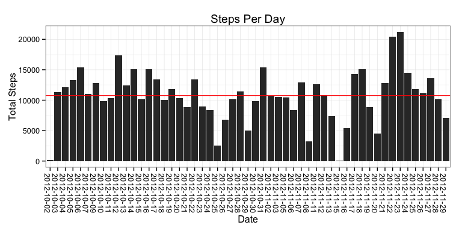

title: "Reproducible Research: Peer Assessment 1"  
=============
author: Barbara Dornseif
output: html_document  
keep_md = true  
=============

## Source & Prepare the Data  
Use whatever directory string is appropriate for you - after that, the following code will all be referential to your environment.  

```r
# Personalize the working directory - this was mine
mywd <-"~/Documents/Coursera/05-ReproducableResearch/05_RepData_PeerAssessment1"
# initiate your working directory.
setwd(mywd)
```

To  source the raw data, you can fork the GitHub repository https://github.com/Saoirsegirl/05_RepData_PeerAssessment1 and sync to a local git - which will copy in  the needed data and code files.  
OR  
You can pull the data from the course web link contained in the code block below.  
The following code block will assess your choice and proceed as needed.

```r
# source and unzip the raw data file into the working directory.
if (!file.exists('/activity.zip')) {  # this will be in place if you fork the repo
    # this will be run if you need the program to source from teh class library.
    file_URL <- "https://d396qusza40orc.cloudfront.net/repdata%2Fdata%2Factivity.zip"
    download.file(file_URL, "./activity.zip", method = "curl" )
}
unzip("./activity.zip", overwrite = TRUE)   # unzip to create "activity.csv" 
unzip_date <- date() 
```
The raw .csv file needs to be read into R, its structures evaluated, and some data transformations made to prepare the data for use in the following Analysis steps. So let's read it in and confirm its contents.  

```r
raw <- read.csv("./activity.csv", stringsAsFactors = FALSE)
summary(raw)
```

```
##      steps            date              interval     
##  Min.   :  0.00   Length:17568       Min.   :   0.0  
##  1st Qu.:  0.00   Class :character   1st Qu.: 588.8  
##  Median :  0.00   Mode  :character   Median :1177.5  
##  Mean   : 37.38                      Mean   :1177.5  
##  3rd Qu.: 12.00                      3rd Qu.:1766.2  
##  Max.   :806.00                      Max.   :2355.0  
##  NA's   :2304
```

```r
raw_summary <- summary(raw)
```
To simplify the following statistical analysis, we will reformat date (a character string) to a date format and the interval (an integer) elements into a class that allows for certain Date/Time manipulations. We will use the lubridate package to execute the transformations and keep the originals as well. The tricky one will be the interval to time formatting, so let's take a closer look at how the data for the 5 minute intravals are structured.

```r
raw[c(1,2,10,13,22,277,288),]
```

```
##     steps       date interval
## 1      NA 2012-10-01        0
## 2      NA 2012-10-01        5
## 10     NA 2012-10-01       45
## 13     NA 2012-10-01      100
## 22     NA 2012-10-01      145
## 277    NA 2012-10-01     2300
## 288    NA 2012-10-01     2355
```
We see the first interval is 0, the second is 5 and the 10th 45. Which implies the interval marks the begining of each five (5) minute interval. As there are 12, five minute intervals per hour, we expect that interval 13 will be the first interval of the 2nd or 1 o'clock hour.  And we see it is identified as "100".  To further confirm the pattern let's use the 10th and 22nd intervals which should reflect the 45th minute of hour 0 and 1 - and viola. 
  
The final test is that the 277th interval should be the first 5 minute or '00' block of hour 23 and the final interval (12 x 24 == 288) is "2355" - which they are.  So now we know that we need to convert "integer" to "character" and then parse the hour and minutes into a character pattern that can be easily converted into a date/time format when paired with date.  
  
Finally we will print out the summary of the new 'data' to confirm the core information has not been improperly transformed. Here goes:

```r
library(lubridate)
class(raw$interval) <- "character"
interval2time <- function(val) {
    if (nchar(val) < 2) { # for hour 0
        val <- paste0("00:0",val) }
    else if (nchar(val) < 3) {  # for hour 0  and minutes > 5
        val <- paste0("00:", val) }
    else if (nchar(val) < 4) { # for hours 1 to 9
        val <- paste0("0", substr(val,1,1),":",substr(val,2,3)) }
    else {val <- paste0(substr(val,1,2),":",substr(val,3,4)) }  # for hours 10 to 23  
    } 
raw$time <- sapply(raw$interval,interval2time)
charDT <- paste(raw$date, raw$time)
DateTime <- ymd_hm(charDT)
data <- cbind(raw, DateTime)
raw_summary
```

```
##      steps            date              interval     
##  Min.   :  0.00   Length:17568       Min.   :   0.0  
##  1st Qu.:  0.00   Class :character   1st Qu.: 588.8  
##  Median :  0.00   Mode  :character   Median :1177.5  
##  Mean   : 37.38                      Mean   :1177.5  
##  3rd Qu.: 12.00                      3rd Qu.:1766.2  
##  Max.   :806.00                      Max.   :2355.0  
##  NA's   :2304
```

```r
summary(data)
```

```
##      steps            date             interval             time          
##  Min.   :  0.00   Length:17568       Length:17568       Length:17568      
##  1st Qu.:  0.00   Class :character   Class :character   Class :character  
##  Median :  0.00   Mode  :character   Mode  :character   Mode  :character  
##  Mean   : 37.38                                                           
##  3rd Qu.: 12.00                                                           
##  Max.   :806.00                                                           
##  NA's   :2304                                                             
##     DateTime                  
##  Min.   :2012-10-01 00:00:00  
##  1st Qu.:2012-10-16 05:58:45  
##  Median :2012-10-31 11:57:30  
##  Mean   :2012-10-31 11:57:30  
##  3rd Qu.:2012-11-15 17:56:15  
##  Max.   :2012-11-30 23:55:00  
## 
```
The comparison of the summary(raw) output and summary(data) output, shows that the steps and date column remain exactly as before, the interval column is transformed into a character vector and the resulting time and DateTime columns mimic the orginal data as desired.  We are good to go!!  

## Analysis Steps
### 1) What is mean total number of steps taken per day?
To display the daily total of steps the raw data is aggregated by day and the results outputted to an analysis data set "stepsPerDay". The following plot shows the daily totals, followed by the mean and median.

```r
library(ggplot2, stringr)
stepsPerDay <- aggregate(steps ~ date, data = data, FUN = sum)
meanSPD <- round(mean(stepsPerDay$steps),0)
medianSPD <- median(stepsPerDay$steps)
```

```r
g1 <- ggplot(stepsPerDay, aes(date, steps))
g1 + geom_bar(stat = "identity") + 
    theme_bw() +
    geom_hline(yintercept = meanSPD, colour = "red") +
    theme(axis.text.x=element_text(angle = -90, hjust = 0)) +
    labs(title = "Steps Per Day") +
    labs(x = "Date") +
    labs(y = "Total Steps")
```


  
A summary of this set shows the mean to be 10,766 (as a red line in the plot) and the median to be 10,765.  

### 2) What is the average daily activity pattern?
Now we know something about the daily totals, let's alter the point of view and look inside the days, and see if we can see any unique characteristics of the intervals as they average out over the 53 of 60 days for which we have data.  To do this we will aggregate the data by the new 'time' field, which will tell us the begining time of the 5 minute interval with the highest average number of steps.

```r
aveStepsPerInterval <- aggregate(steps ~ time, data = data, FUN = mean)
aveStepsPerInterval <- cbind(t = 1:288,aveStepsPerInterval)
maxASPI <- max(aveStepsPerInterval$steps)
maxInt <- aveStepsPerInterval[aveStepsPerInterval$steps == maxASPI,]
maxTime <- maxInt[,1]
maxSteps <- round(maxInt[,3],1) 

plot(aveStepsPerInterval$t, aveStepsPerInterval$steps, type = 'l', 
     main = "Average of Steps Per Interval",
     col = "black",  xaxt = 'n', #pch = 19,
     xlab = "Start Time of 5-Minute Interval",
     ylab = "Average of Steps")
#axisTicks(usr = c(1,288), log = FALSE, nint = 23)
#axis(1, xaxp = c(0,aveStepsPerInterval$time))
abline(v = maxTime)
```

 
  
For the 288 5-minute interval averages we see that the 08:35 interval has the highest average (206.2) over the 53 days of observed measurements.  

### 3) Imputing missing values


### 4) Are there differences in activity patterns between weekdays and weekends?
