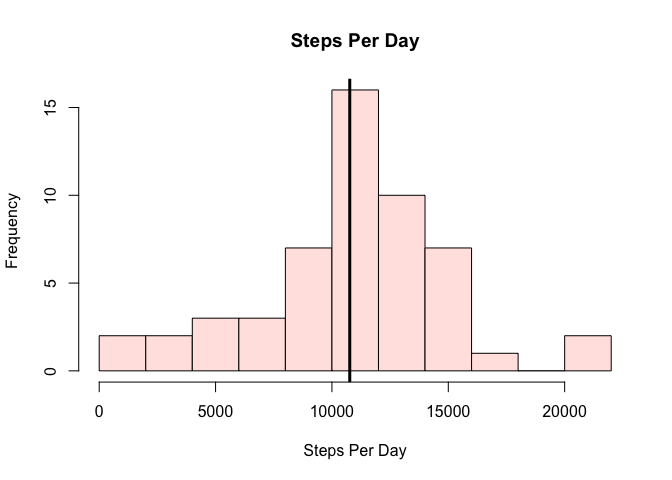
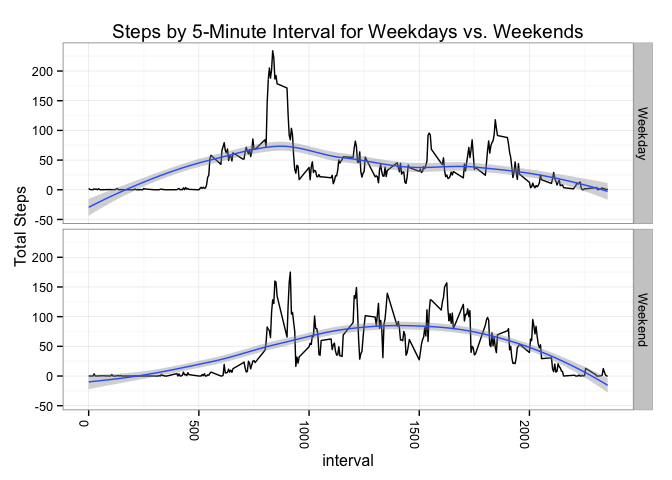

title: "Reproducible Research: Peer Assessment 1"  
=============
  
## Source & Prepare the Data  
Use whatever working directory string is appropriate for you - after that, the following code will all be referential to your environment.  Set your wd here:

```r
# Personalize the working directory - this was mine
mywd <-"~/Documents/Coursera/05-ReproducableResearch/05_RepData_PeerAssessment1"
# initiate your working directory.
setwd(mywd)
```

To  source the raw data, you can fork the GitHub repository https://github.com/Saoirsegirl/05_RepData_PeerAssessment1 and sync to a local git - which will copy in  the needed data and code files.  
OR  
You can pull the data from the course web link contained in the code block below.  
The following code block will assess your choice and proceed as needed.

```r
# source and unzip the raw data file into the working directory.
if (!file.exists('./activity.zip')) {  # this will be in place if you fork the repo
    # this will be run if you need the program to source from the class library.
    file_URL <- "https://d396qusza40orc.cloudfront.net/repdata%2Fdata%2Factivity.zip"
    download.file(file_URL, "./activity.zip", method = "curl" )
}
unzip("./activity.zip", overwrite = TRUE)   # unzip to create "activity.csv" 
unzip_date <- date() 
```
The raw .csv file needs to be read into R, its structures evaluated, and some data transformations made to prepare the data for use in the following Analysis steps. So let's first read it in and confirm its contents and structure.  

```r
raw <- read.csv("./activity.csv", stringsAsFactors = FALSE)
summary(raw) # display a summary of data content
```

```
##      steps            date              interval     
##  Min.   :  0.00   Length:17568       Min.   :   0.0  
##  1st Qu.:  0.00   Class :character   1st Qu.: 588.8  
##  Median :  0.00   Mode  :character   Median :1177.5  
##  Mean   : 37.38                      Mean   :1177.5  
##  3rd Qu.: 12.00                      3rd Qu.:1766.2  
##  Max.   :806.00                      Max.   :2355.0  
##  NA's   :2304
```

```r
raw_summary <- summary(raw) # save the summary for later
str(raw) # display the strucutre of the data content
```

```
## 'data.frame':	17568 obs. of  3 variables:
##  $ steps   : int  NA NA NA NA NA NA NA NA NA NA ...
##  $ date    : chr  "2012-10-01" "2012-10-01" "2012-10-01" "2012-10-01" ...
##  $ interval: int  0 5 10 15 20 25 30 35 40 45 ...
```
To simplify the following statistical analysis, we will reformat the interval column (an integer) element into a character string that can then be concatenated with the date column and create a class that allows for more fleible Date/Time manipulations. We will need the lubridate package to execute the the final transformations. And we will keep the originals as well. 

The tricky one will be the interval to time formatting, so let's take a closer look at how the data for the 5 minute intravals are structured so we can perform the correct coding logic.

```r
library(lubridate)
raw[c(1,2,10,13,22,277,288),] # select out 7 rows of data
```

```
##     steps       date interval
## 1      NA 2012-10-01        0
## 2      NA 2012-10-01        5
## 10     NA 2012-10-01       45
## 13     NA 2012-10-01      100
## 22     NA 2012-10-01      145
## 277    NA 2012-10-01     2300
## 288    NA 2012-10-01     2355
```
We see the first interval is identified as 0, the second as 5 and the 10th 45. Which implies the interval marks the begining of each five (5) minute interval. As there are 12, five minute intervals per hour, we expect that interval 13 will be the first interval of the 2nd or 1 o'clock hour.  And we see it is identified as "100".  To further confirm the pattern let's use the 10th and 22nd intervals which should reflect the 45th minute of hours 0 and 1 - and viola our hypothesis is confirmed. 
  
The final test is that the 277th interval should be the first 5 minute or '00' block of hour 23 and the final interval (12 x 24 == 288) is "2355" - which we can see in our test. 

So now we know how we need to convert "integer" to "character" (first two digits are hour and second two are minutes of the start of the interval) and then parse the hour and minutes into a character pattern that can be merged with the date column and then easily converted into our choosen date/time format.  
  
Finally we will print out the summary of the new 'data' to confirm the core information has not been improperly transformed. Here goes:

```r
library(lubridate)

# Let's create a special use functions to use in a simple sapply()
interval2time <- function(val) {
    if (nchar(val) < 2) { # for hour 0 - add three 0s to create a 4 character string
        val <- paste0("000",val) }
    else if (nchar(val) < 3) {  # for hour 0 and minutes > 5 - add two 0s
        val <- paste0("00", val) }
    else if (nchar(val) < 4) { # for hours 1 to 9 - add one 0
        val <- paste0("0", substr(val,1,1),substr(val,2,3)) }
    else {val <- paste0(substr(val,1,2),substr(val,3,4)) }  # for hours 10 to 23  
    } 

# Now we are ready to do our transformations
raw$charInterval <- sapply(raw$interval, as.character) # Integer as character
raw$time <- sapply(raw$charInterval,interval2time)  # use our special function
charDT <- paste(raw$date, raw$time) # concatenate character fields Date and Time
raw$dateTime <- ymd_hm(charDT)  # create our final Date/Time field as POSIXct

# let's compare and validate that we got the desired transformations
raw_summary
```

```
##      steps            date              interval     
##  Min.   :  0.00   Length:17568       Min.   :   0.0  
##  1st Qu.:  0.00   Class :character   1st Qu.: 588.8  
##  Median :  0.00   Mode  :character   Median :1177.5  
##  Mean   : 37.38                      Mean   :1177.5  
##  3rd Qu.: 12.00                      3rd Qu.:1766.2  
##  Max.   :806.00                      Max.   :2355.0  
##  NA's   :2304
```

```r
summary(raw)
```

```
##      steps            date              interval      charInterval      
##  Min.   :  0.00   Length:17568       Min.   :   0.0   Length:17568      
##  1st Qu.:  0.00   Class :character   1st Qu.: 588.8   Class :character  
##  Median :  0.00   Mode  :character   Median :1177.5   Mode  :character  
##  Mean   : 37.38                      Mean   :1177.5                     
##  3rd Qu.: 12.00                      3rd Qu.:1766.2                     
##  Max.   :806.00                      Max.   :2355.0                     
##  NA's   :2304                                                           
##      time              dateTime                  
##  Length:17568       Min.   :2012-10-01 00:00:00  
##  Class :character   1st Qu.:2012-10-16 05:58:45  
##  Mode  :character   Median :2012-10-31 11:57:30  
##                     Mean   :2012-10-31 11:57:30  
##                     3rd Qu.:2012-11-15 17:56:15  
##                     Max.   :2012-11-30 23:55:00  
## 
```

```r
str(raw)
```

```
## 'data.frame':	17568 obs. of  6 variables:
##  $ steps       : int  NA NA NA NA NA NA NA NA NA NA ...
##  $ date        : chr  "2012-10-01" "2012-10-01" "2012-10-01" "2012-10-01" ...
##  $ interval    : int  0 5 10 15 20 25 30 35 40 45 ...
##  $ charInterval: chr  "0" "5" "10" "15" ...
##  $ time        : chr  "0000" "0005" "0010" "0015" ...
##  $ dateTime    : POSIXct, format: "2012-10-01 00:00:00" "2012-10-01 00:05:00" ...
```
The comparison of the summary(raw) output and summary(data) output, shows that the steps and date columns contents remain exactly as before, the interval column is transformed into a character vector and the DateTime column hold the "same" content as the orginal data in their new data formats.  

Finally we must created a factor vector for Weekday/end to allow for segmentation of the data set by that dimension of time. As the data set is relatively small, we will do this in a rather verbose process so we can validate each step.  For larger data sets, we can and should compress the steps to reduce the number of columns in our final data set prepared for analysis.

```r
dow <- weekdays(as.Date(raw$date))
dowID <- wday(as.Date(raw$date)) # sunday = 1, monday = 2 etc...
dowIDMon <- ifelse(wday(dowID)==1,6,wday(dowID)-2) # make Sunday = 6 and Monday = 0
WeekDays <- ifelse(dowIDMon < 5, "Weekday", "Weekend") # weekend = 5 & 6, weekday < 5
data <- cbind(raw, dow, dowID, dowIDMon, WeekDays) # create our analysis data.frame
summary(data)
```

```
##      steps            date              interval      charInterval      
##  Min.   :  0.00   Length:17568       Min.   :   0.0   Length:17568      
##  1st Qu.:  0.00   Class :character   1st Qu.: 588.8   Class :character  
##  Median :  0.00   Mode  :character   Median :1177.5   Mode  :character  
##  Mean   : 37.38                      Mean   :1177.5                     
##  3rd Qu.: 12.00                      3rd Qu.:1766.2                     
##  Max.   :806.00                      Max.   :2355.0                     
##  NA's   :2304                                                           
##      time              dateTime                          dow      
##  Length:17568       Min.   :2012-10-01 00:00:00   Friday   :2592  
##  Class :character   1st Qu.:2012-10-16 05:58:45   Monday   :2592  
##  Mode  :character   Median :2012-10-31 11:57:30   Saturday :2304  
##                     Mean   :2012-10-31 11:57:30   Sunday   :2304  
##                     3rd Qu.:2012-11-15 17:56:15   Thursday :2592  
##                     Max.   :2012-11-30 23:55:00   Tuesday  :2592  
##                                                   Wednesday:2592  
##      dowID      dowIDMon        WeekDays    
##  Min.   :1   Min.   :0.000   Weekday:12960  
##  1st Qu.:2   1st Qu.:1.000   Weekend: 4608  
##  Median :4   Median :3.000                  
##  Mean   :4   Mean   :2.918                  
##  3rd Qu.:6   3rd Qu.:5.000                  
##  Max.   :7   Max.   :6.000                  
## 
```

```r
str(data)
```

```
## 'data.frame':	17568 obs. of  10 variables:
##  $ steps       : int  NA NA NA NA NA NA NA NA NA NA ...
##  $ date        : chr  "2012-10-01" "2012-10-01" "2012-10-01" "2012-10-01" ...
##  $ interval    : int  0 5 10 15 20 25 30 35 40 45 ...
##  $ charInterval: chr  "0" "5" "10" "15" ...
##  $ time        : chr  "0000" "0005" "0010" "0015" ...
##  $ dateTime    : POSIXct, format: "2012-10-01 00:00:00" "2012-10-01 00:05:00" ...
##  $ dow         : Factor w/ 7 levels "Friday","Monday",..: 2 2 2 2 2 2 2 2 2 2 ...
##  $ dowID       : num  2 2 2 2 2 2 2 2 2 2 ...
##  $ dowIDMon    : num  0 0 0 0 0 0 0 0 0 0 ...
##  $ WeekDays    : Factor w/ 2 levels "Weekday","Weekend": 1 1 1 1 1 1 1 1 1 1 ...
```
## Analysis Steps
### 1) What is mean total number of steps taken per day?
To display the daily total of steps the data must be aggregated by day and the results outputted to an analysis data set "stepsPerDay". The following histogram shows the frequency of daily totals and the mean.

```r
library(ggplot2, stringr)
stepsPerDay <- aggregate(steps ~ date, data = data, FUN = sum)
meanSPD <- round(mean(stepsPerDay$steps),0)
medianSPD <- median(stepsPerDay$steps)

hist(stepsPerDay$steps, breaks=9, col = "mistyrose1",
     main= "Steps Per Day", xlab= "Steps Per Day")
abline(v=meanSPD, lwd=3)
```

 
Numerically stated, the mean is 10,766 (the black line in the plot) and the median is 10,765.  

### 2) What is the average daily activity pattern?
Now we know something about the daily totals, let's alter the point of view and look inside the days, and see if we can see any unique characteristics of the intervals as they average out over the 53 of 60 days for which we have data.  To do this we will aggregate the data by the new 'time' field, which will tell us the begining time of the 5 minute interval with the highest average number of steps.

```r
aveSPI <- aggregate(steps ~ time, data = data, FUN = mean)
aveSPI <- cbind(t = 1:288,aveSPI)
maxASPI <- max(aveSPI$steps)
maxInt <- aveSPI[aveSPI$steps == maxASPI,]
maxTime <- maxInt[,2]
maxSteps <- round(maxInt[,3],0) 


plot(aveSPI$time, aveSPI$steps, type = 'l', 
     main = "Average of Steps Per Interval",
     col = "black",  #xaxt = 'n', #pch = 19,
     xlab = "Start Time of 5-Minute Interval",
     ylab = "Average of Steps")
abline(v = maxTime, col = "red")
```

 
  
For the 288 5-minute interval averages we see that the 0835 interval has the highest average (206) over the 53 days of observed measurements.  

### 3) Imputing missing values
Because there are NA's   :2304   in the summary of raw data or 13.11 percent of the data set, we will need to explore methods of imputing the missing values in order to smooth out the data and make more naunced conclusions related to the activity levels of our test subject.  

Because we all intuitively know that different days of the week have potentially different activity levels throughout the day, we will use our known data in a manner that will identify each typical interval for day of the week (dow) combination and save it off into a new data.frame.  We will then insert the "typical" value related to any interval that is missing.  

This approach admittedly does NOT account for anomolous "sleeping hours" intervals - where a lack of steps is logical and desired.  A future inhancement would be to evaluate the 8 hour time block that is the "sleeping hours" and if the measured interval being evaluated is zero AND in that sleeping block, then the "typical" value would not be overwritten.  At this time, that enhancement is out of scope to the project.


```r
### 4) Are there differences in activity patterns between weekdays and weekends?  
```

```r
# Prepare data for use in this question
dayEndSPI <- aggregate(steps ~ interval + WeekDays, data = data, FUN = sum)
```
Our Aggregate of data creates two set of intervals - one of Weekdays and one for WeekEnd days. From there we can see if the interval pattern is different between the two day week factors. 

```r
g3 <- ggplot(dayEndSPI, aes(interval, steps))
g3 + geom_point() + # facet_grid(as.factor(Day)) +  not sure why this is throwing an error. No more time to debug :-(  sorry, I HATE doing incomplete work!!
  geom_smooth(method = "lm") +
  theme_bw() +
  theme(axis.text.x=element_text(angle = -90, hjust = 0)) +
  labs(title = "Steps by 5-Minute Interval for Weekdays vs. Weekends") +
  labs(y = "Total Steps")
```

 

